# the_hangedman

(Developer: Gianluca Zimmatore)

## Introduction ##
**the_hangedman** is an online is a Python terminal version of the classic hangman game. The aim of the game, as we know, is to guess a secret word (randomply chosen by the computer from a specific list) letter by letter, but in a range of maximum six attempts. If you guess the word within this range you win, otherwise you lose.

[Live webpage](https://the-hangedman-9d230e2d51fc.herokuapp.com/)
 
 
 

## Table of Content

1. [Project Goals](#project-goals)
    1. [User Goals](#user-goals)
    2. [Site Owner Goals](#site-owner-goals)
2. [User Experience](#user-experience)
    1. [How To Play](#how-to-play)
    2. [User Stories](#user-stories)
        1. [Users](#users)
        2. [Site Owner](#site-owner)
3. [Design](#design)
    1. [Design Choices](#design-choices)
    2. [Game Logic General Idea](#game-logic-general-idea)
4. [Technologies Used](#technologies-used)
    1. [Languages](#languages)
    2. [Frameworks & Tools](#frameworks-&-tools)
5. [Features](#features)
    1. [Title](#title)
    2. [Menu](#menu)
        1. [Start](#start)
        2. [Instructions](#instructions)
    3. [Ask Username](#ask-username)
    4. [Actual Game Display](#actual-game-display)
    5. [Game Over](#game-over)
        1. [Win](#win)
        2. [Lose](#lose)
    6. [Exit Game Message](#exit-game-message)
6. [Game Logic Less General Idea](#game-logic-less-general-idea)
7. [Bugs](#Bugs)
    1. [Fixed Bugs](#fixed-bugs)
    2. [Unfixed Bugs](#unfixed-bugs)
8. [Deployment](#deployment)
9. [Credits](#credits)
    1. [General References](#general-references)
    2. [Code](#code)
10. [Acknowledgements](#acknowledgements)

## Project Goals 

### User Goals
- Playing a classic hangman game. 
- Finding easily the instructions about the game.
- Receiving clear information about what's happening during a game,
- Playing easily a new game (or exiting the program with the same ease)

### Site Owner Goals
- Providing a good UX/UI.
- Providing a fully working videogame with no bugs.
- Providing clear information about what to do in order to play.
 
 
 

## User Experience

### How To Play
1. The aim of the game is to guess a random word letter by letter;
2. To guess, type a letter (no punctuation, spaces or numbers are allowed) and press enter;
3. If you guess correctly, the letter will be revealed in its exact position in
   the secret dashed word (each dash is a letter, so you can know before starting to play how many letters you have to guess)
4. If you guess incorrectly, you will lose a "life" and the hanged man will
   start to build.
5. You have 6 "lives", that is 6 attempts, to guess the correct word: head, torso, two arms and two
   legs
6. The word that you have to guess can be everything: a singular name, a plural
   name, a verb, a past participle, etc.

*By the way, you can find all the instructions directly on the [live webpage](https://the-hangedman-9d230e2d51fc.herokuapp.com/) of this project or, if you want to have more general information about it, in the Wikipedia page about the [hangman game](https://en.wikipedia.org/wiki/Hangman_(game))*
 
 

### User Stories

#### Users 
1. As a user, I want to know quickly what the website is about.
2. As a user, I want to easily understand how to play.
3. As a user, I want to see if I am doing something wrong and what to do to correct myself.
4. As a user, I want to be able to play again easily.

#### Site Owner 
1. As the site owner, I want users to understand immediately what the site is about.
2. As the site owner, I want to avoid any possible bug to break the game.
3. As the site owner, I want to give a special taste to a perhaps "too classic" game with some special "handmade" ASCII art.
 
 
 

## Design

### Design Choices
The terminal emulator provided by the Code Institute (and, more in general, the fact that the purpose of this project is just to "build a command-line application") kind of minimised the possibilities of creating my own design. I could have used libraries such as colorama to differentiate the output with colours, but I preferred to give a soul to the game by using customized (and sometimes humorous, depending on the point of view, of course) output, in advance and in response to users' inputs, while on a visual level keeping a sketchy, classic, "terminal" style, sealing it with the help of pieces of ASCII art that I did myself (which can be seen in the main title - showing up as the user starts a new game or exits the program - and in the menu "board"). In addition to this, I created and charged a favicon showing the quite recognizable shape of a gibbet.

### Game Logic General Idea
A design feature is, in my personal sense of the word, also the way the game logic has been thought - and designed, in fact. We're all aware of the rules of the hangman game (you can find all the instructions directly on the [live webpage](https://the-hangedman-9d230e2d51fc.herokuapp.com/) of this project or in the Wikipedia page about the [hangman game](https://en.wikipedia.org/wiki/Hangman_(game))); in our chase, a flowchart describing the general game logic it's probably more descriptive (further on, in another section, we will see a similar flowchart integrating also functions and user inputs).

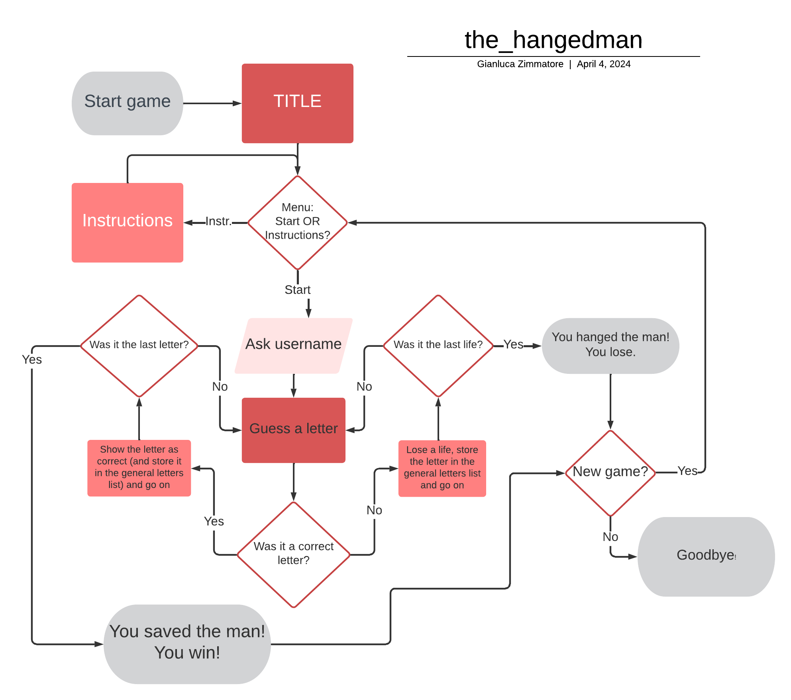
 
 
 

## Technologies Used

### Languages
- HTML
- Python

### Frameworks & Tools
- [Git](https://git-scm.com/)
- [GitHub](https://github.com/)
- [Gitpod](https://gitpod.io/)
- [Heroku](https://www.heroku.com/)
- [Am I Responsive?](https://ui.dev/amiresponsive)
- [Favicon](https://favicon.io/)
- [Snipping Tool](https://apps.microsoft.com/detail/9MZ95KL8MR0L?hl=en-US&gl=US)
- [Paint](https://www.microsoft.com/it-it/windows/paint)
- [Lucidchart](https://www.lucidchart.com/pages/)
- [Google](https://www.google.com/)
- [W3C Markup Validation Service](https://validator.w3.org/)
- [CI Python Linter](https://pep8ci.herokuapp.com/)
 
 
 

## Features

*for input validation and error checking we link to the general [TESTING.md](TESTING.md) file.*

### Title
- This feature is displayed automatically as soon as the user runs the program, starts a new game or decides to exit the game. It consists of a three levels structure, all three an example of (autographic) ASCII art:
    1. The top levels it's some sort of acronym (not exactly an acronym) with the three letters: "h", "G" and "n" (from the far left, center and right of the word "hangman") in a bidimensional way (the "h" has its shadow pushing leftwards, the "G" towards the center and the "n" rightwards). Each letter is "coloured" with the same letter but capitalized;
    2. The actual title of the game "the hangedman", written in a more readable way;
    3. a visual logo, to let the user understand (once again, if needed) what the game is about: the drawing of gallows with an hanging man saying: "life is but a slipknot", as a motto of the game.

    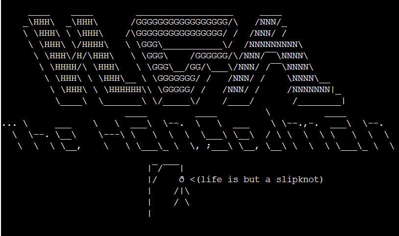
 
 

### Menu
- This feature is displayed as well automatically as soon as the user either runs the program or starts a new game. As the Title, it's an example of autographic ASCII art. We will show its general appearence (constituted by some kind of billboard, from which four sketchy men are hanging) and briefly explain its only two (self-evident, actually) functions:

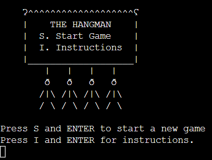

#### Start
- If the user presses the letter "s/S" and then Enter, a new game starts. We will see a few screenshots from the game further on.

#### Instructions
- If the user presses the letter "i/I" and then Enter, the instructions of the hangman game will be displayed, together with some vague suggestions about which kind of input the terminal will accept as valid and which kind of words are potentially to be guessed. After reading the instructions, the user has to press Enter to go back to the Menu (the ASCII art won't be displayed this time):

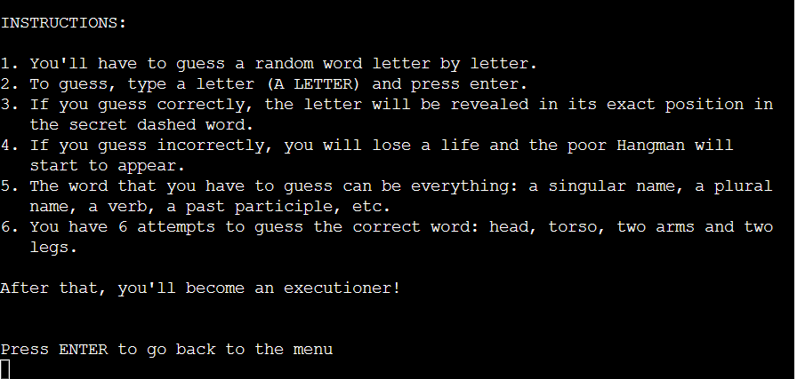
 
 

### Ask Username
- To be precise, after the user presses the letter "s/S", before a new game begins, the program asks his/her name. The user then will input the name, which from then on will be displayed with the first letter capitalised (no matter if the user actually had the consideration of writing it in that way):

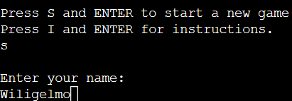
 
 

### Actual Game Display
- Once the game starts, as already said, the user will have to guess the right letters. Hereafter we'll just show three of screenshots from the gameplay (the empty gallows and after the first and the fourth mistake), just to have an idea of the body of the Hangedman building after missing a few "lives". You'll have time to see the whole game by playing it. And, as you can see, the list of the letters guessed so far, no matter if correctly or incorrectly guessed, is displayed close to the word to guess, that is to the user eyes, for a better UX:

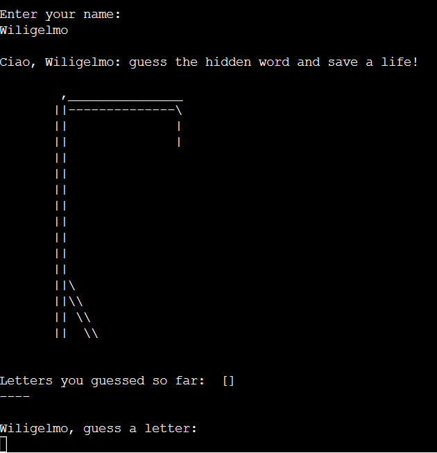

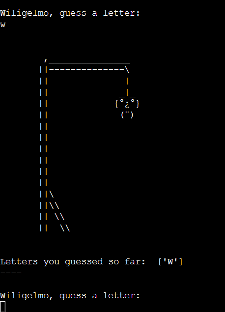

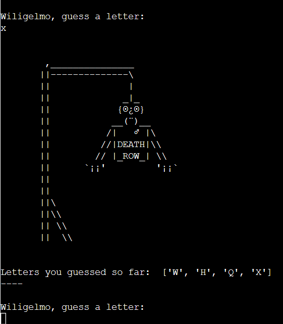
 
 

### Game Over
- The game will be over either when the user guesses correctly all the letters in the secret word (that is, by winning the game) or when the user didn't guess the word but wasted his/her 6 "lives" trying to guess (that is, by losing the game). Two different message will be displayed in either of the two cases, but in the end will be always offered to the player the chance to play another game (by inserting the letter "y/Y" and Enter), or to exit the game if he/she's just fed up of hanging bodies.

#### Win
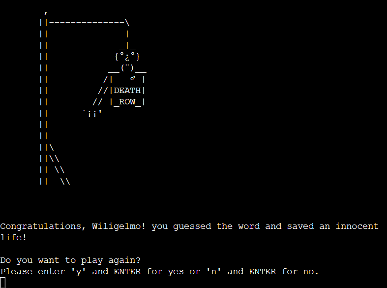

#### Lose
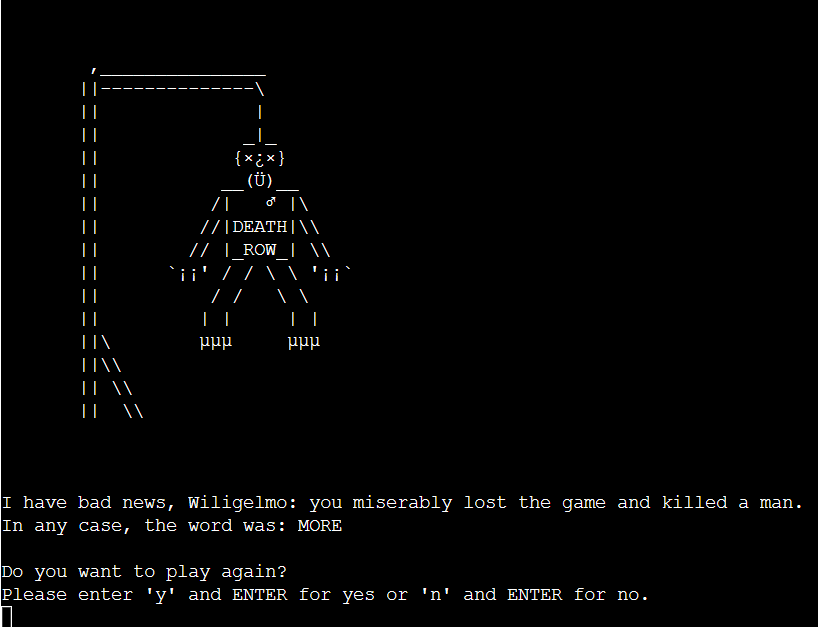
 
 

### Exit Game Message
- If the user wants to leave the game, the following message will be displayed, along with the Title (as mentioned before):

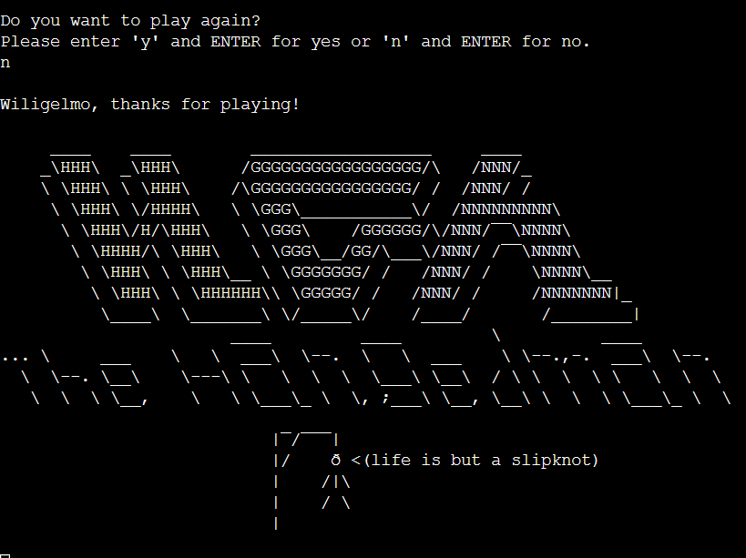
 
 
 

## Game Logic Less General Idea

I wanted to call this section "Game Logic Less General Idea" because here the logic of the game won't be described very specifically: a specific description may only come by putting in comparison the actual code, the docstrings describing in general what the functions are supposed to do and the comments to highlight certain steps which may not be clear enough and the following flowchart:

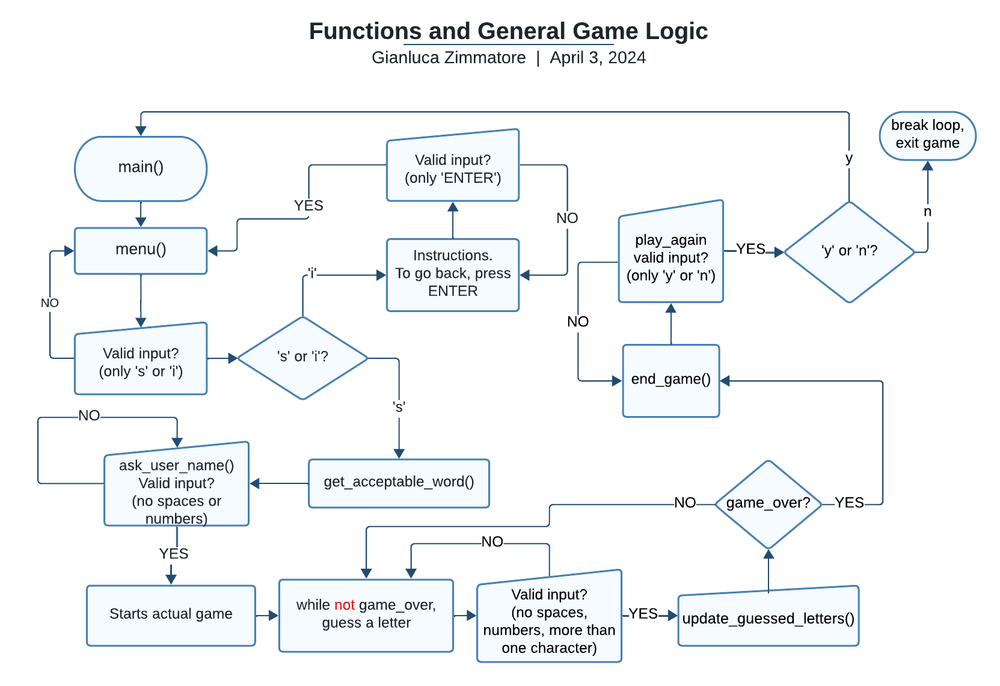

Basically, all the game is governed by the main() function and, specifically, by a while loop inside it; all the other functions are called inside it. For a better readability, I created another Python file with all the constants which I imported at the beginning of our run.py file (together with the random and the string modules, only used before the actual game starts, that is: to "eject" punctuation, spaces or eventual numbers from our source of words and to choose a random one from this conglomerate). I tried to keep the program as neat and atomical as possible, but I am sure that it could be refactored and streamlined.
 
 
 