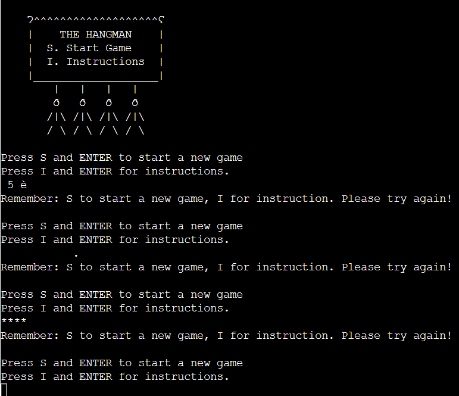
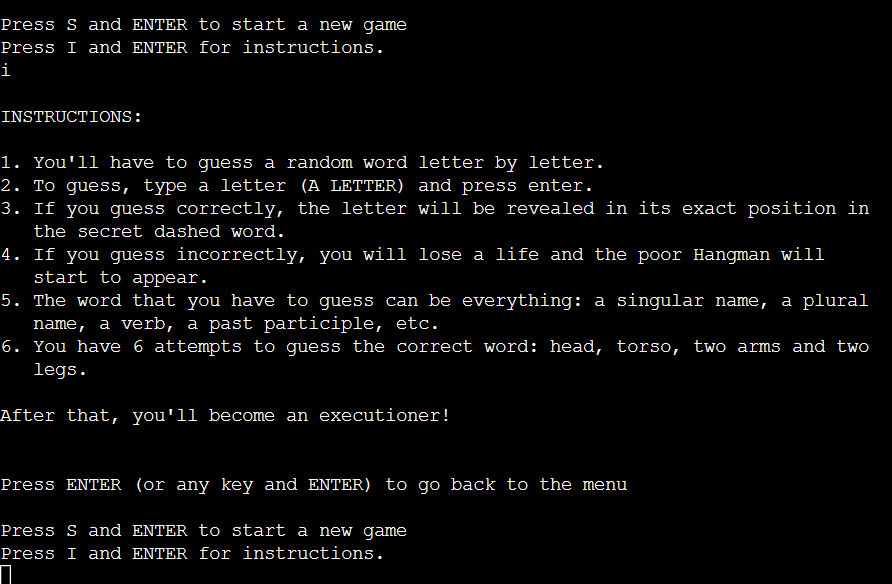
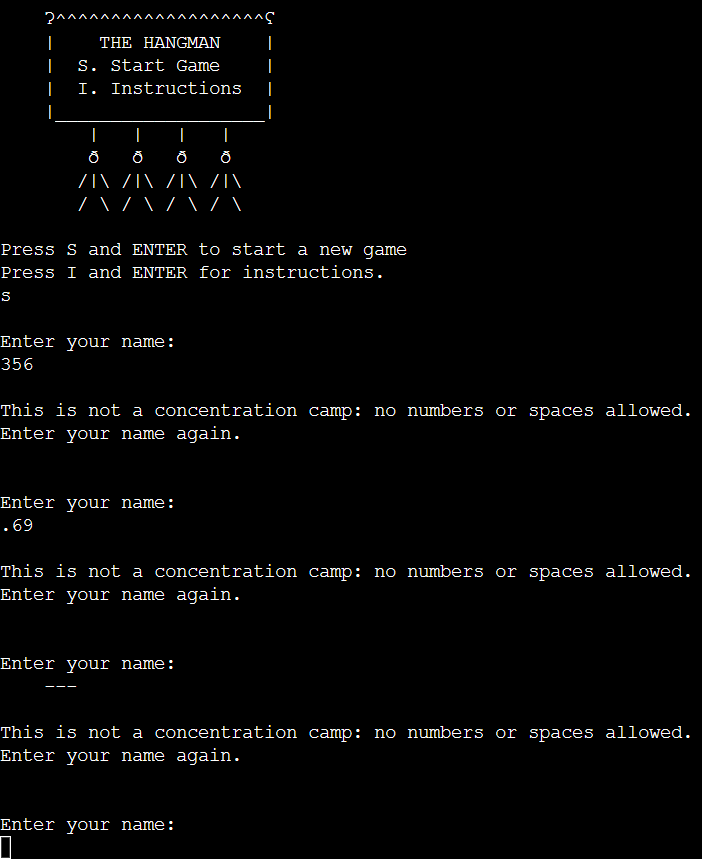
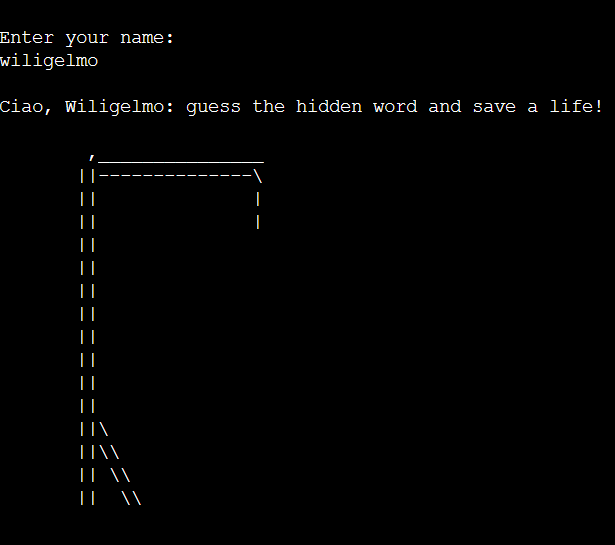

# Testing

## Table Of Contents

1. [Manual testing](#manual-testing)
    1. [Inputs Testing](#inputs-testing)
    2. [Testing User Stories](#testing-user-stories)
2. [Validation](#validation)
    1. [PEP8 Code Institute Python Linter](#pep8-code-institute-python-linter)
    2. [HTML Validation](#HTML-validation)
    3. [Browser compatibility](#browser-compatability)
    4. [Device testing](#device-testing)

## Manual Testing
I constantly tested manually the general performance of the program, both on the my workspace and on the deployed website (that you can find [here](https://the-hangedman-9d230e2d51fc.herokuapp.com/)), thrthroughout its development. The flow of the game is working, so does its logic; therefore we're going to test (and show the results of those tests) what it's considered to be the weakest part of such a game, that are the inputs.

### Inputs Testing

1. The first input we're going to test is the main one within the menu() function. As it can be seen from the following screenshot, no matter how many several inputs you try to give (spaces, spaces and other characters, number, punctuation), the program demands only "s/S" or "i/I" in order to give the expected results:

2. The second input we *should* test is contained as well within the menu() function; as we have read, by inserting "s/S" when required we start a new game, but if we insert "i/I" the game rules are displayed. After that, I could have required to insert a specific key only in order to get back to the main menu: but why? The point here is to play the game. There's no reason to hinder the user to go back to the main menu; hence, the message (and the related game logic): "Press ENTER (or any key and ENTER) to go back to the menu".

3. After inserting "s/S", we are finally asked to enter our name. We can't use numbers, spaces, punctuation or any combination of these:

4. If we eventually decide to give a proper (alphabetic) name, even if we enter a name with a first lowercase letter, the computer returns it uppercase:

