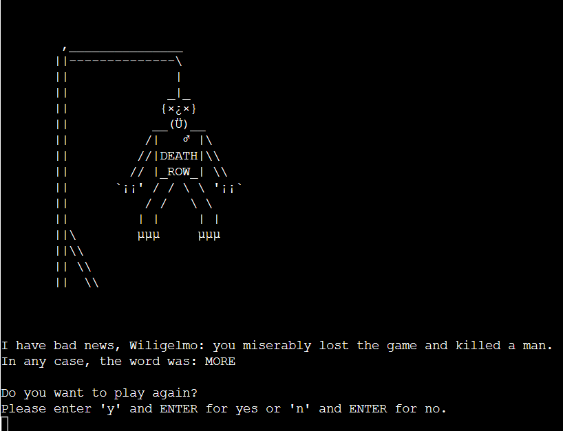
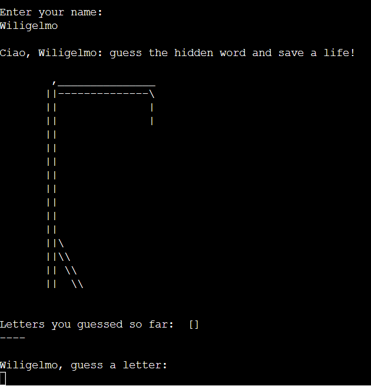

# Testing

## Table Of Contents

1. [Manual testing](#manual-testing)
    1. [Inputs Testing](#inputs-testing)
    2. [Testing User Stories](#testing-user-stories)
2. [Validation](#validation)
    1. [PEP8 Code Institute Python Linter](#pep8-code-institute-python-linter)
    2. [HTML Validation](#HTML-validation)
    3. [Browser compatibility](#browser-compatability)
    4. [Device testing](#device-testing)

## Manual Testing
I constantly tested manually the general performance of the program, both on the my workspace and on the deployed website (that you can find [here](https://the-hangedman-9d230e2d51fc.herokuapp.com/)), thrthroughout its development. The flow of the game is working, so does its logic; therefore we're going to test (and show the results of those tests) what it's considered to be the weakest part of such a game, that are the inputs.

### Inputs Testing

1. The first input we're going to test is the main one within the menu() function. As it can be seen from the following screenshot, no matter how many several inputs you try to give (spaces, spaces and other characters, number, punctuation), the program demands only "s/S" or "i/I" in order to give the expected results:

 

2. The second input we *should* test is contained as well within the menu() function; as we have read, by inserting "s/S" when required we start a new game, but if we insert "i/I" the game rules are displayed. After that, I could have required to insert a specific key only in order to get back to the main menu: but why? The point here is to play the game. There's no reason to hinder the user to go back to the main menu; hence, the message (and the related game logic): "Press ENTER (or any key and ENTER) to go back to the menu".

 

3. After inserting "s/S", we are finally asked to enter our name. We can't use numbers, spaces, punctuation or any combination of these:

 

4. If we eventually decide to give a proper (alphabetic) name, even if we enter a name with a first lowercase letter, the computer returns it uppercase:

 

5. Now the actual game starts: once again, we're not allowed to use numbers, spaces, punctuation or any combination of these, as we'll see in the following screenshots:

*Here we try to input a dash: it doesn't work.*
 
 

*Here we try to input a number: it doesn't work either.*
 
 

*Here we try with spaces and a combo of dots and commas.*
 
 

*Here we try with a space and a letter: still nothing.*
 
 

*We try to insert a bunch of letters: it doesn't work.*
 
 

*Here we finally try to enter a salad of stuff: the program doesn't accept this input.*
 
 

6. The final input the program asks us to insert is the "y/Y" or "n/N" depending on our will to play a new game or not. Once again, there's no escaping:

*After a miserable fail, we're asked if we want to play again: all the inputs given, since are not "y/Y" or "n/N", are refused.*
 
 
 

### Testing User Stories

**Users**

1. As a user, I want to know quickly what the website is about.

| **Feature** | **Action** | **Expected Result** | **Actual Result** |
|-------------|------------|---------------------|-------------------|
| Title | Have a look at the title and the ASCII arts | Notice that this is a classic hangman game | Works as expected |

Screenshots

 
 

2. As a user, I want to easily understand how to play.

| **Feature** | **Action** | **Expected Result** | **Actual Result** |
|-------------|------------|---------------------|-------------------|
| Instructions | Go inside the Menu and enter "i/I" to read the instructions | Learn the rules of our hangman game | Works as expected |

Screenshots

 
 

3. As a user, I want to see if I am doing something wrong and what to do to correct myself.

| **Feature** | **Action** | **Expected Result** | **Actual Result** |
|-------------|------------|---------------------|-------------------|
| Invalid Input Messages | Do exactly the opposite of what the automatic messages tell you to do and you'll get a corrective response | Learn what to input | Works as expected |

Screenshots

*These are just a couple of examples, but we know that during all the gameplay if you do something wrong you'll be constantly corrected by the computer until you'll input something considered correct.*

 
 

4. As a user, I want to be able to play again easily.

| **Feature** | **Action** | **Expected Result** | **Actual Result** |
|-------------|------------|---------------------|-------------------|
| Game Over display messages | Have a look at the final message after the Game Over (in both cases of defeat or victory) | Notice that you can just enter "y/Y" to play again or "n/N" to exit the game | Works as expected |

Screenshots

 
 

**Site Owner**

1. As the site owner, I want users to understand immediately what the site is about.

| **Feature** | **Action** | **Expected Result** | **Actual Result** |
|-------------|------------|---------------------|-------------------|
| Title | Have a look at the title and the ASCII arts | Notice that this is a classic hangman game | Works as expected |

Screenshots

 
 

2. As the site owner, I want to avoid any possible bug to break the game.

| **Feature** | **Action** | **Expected Result** | **Actual Result** |
|-------------|------------|---------------------|-------------------|
| A decent code | Write a decent code | No bugs or exceptions | In this case, works as expected |

 
 

3. As the site owner, I want to give a special taste to a perhaps "too classic" game with some special "handmade" ASCII art.

| **Feature** | **Action** | **Expected Result** | **Actual Result** |
|-------------|------------|---------------------|-------------------|
| Title, Actual Game Display | Have a look at the title and the ASCII arts of the building hangman during the game | Enjoy the personal style of the developer | Works as expected |

Screenshots

 
 
 